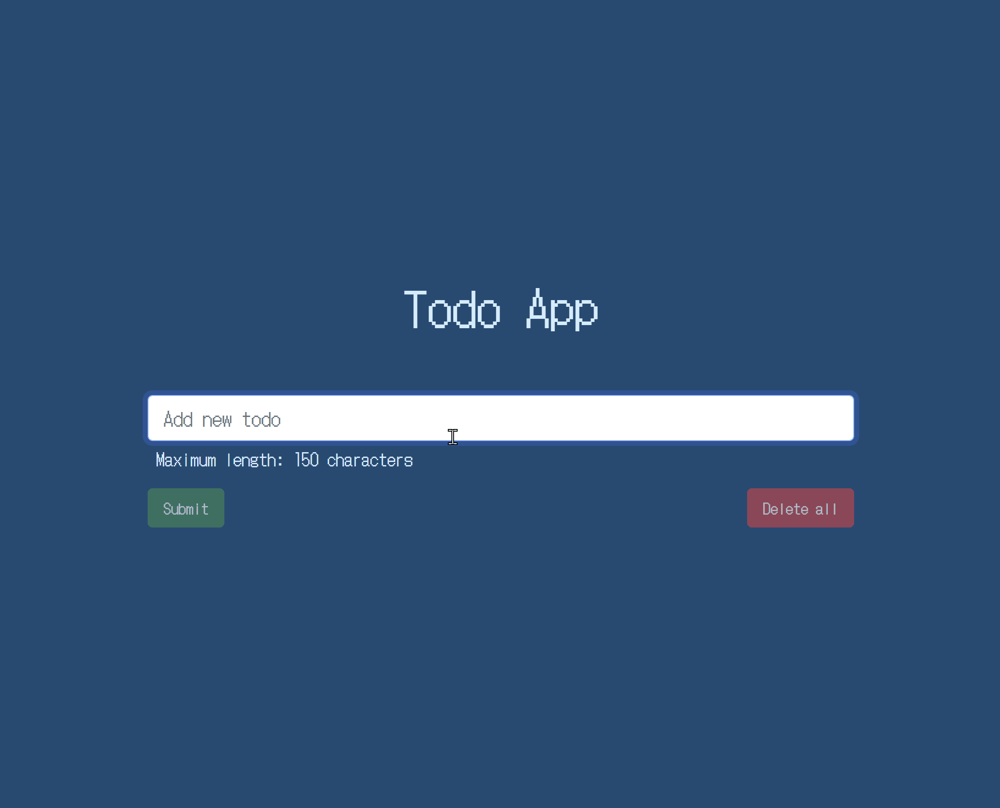

# todo-angularjs

## Hosted on GitHub Pages

https://vokenny.github.io/todo-angularjs/

Todo application\* on AngularJS 1.8

Practice for using the AngularJS framework with a simple CRUD application.

\*Uses local storage.

